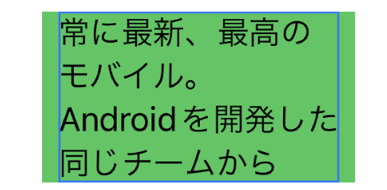

# MikanSwift

This project was originally ported from [mikan.js](https://github.com/trkbt10/mikan.js). (Special thanks to the original authors and contributors.)

Provides a solution to Japanese work break problems by using simple morphological analysis with regular expressions. In particular, it is common in Japanese texts that a single character will be pushed to a new line.

| Before (Text)  | After (MikanText) |
| ------------- | ------------- |
|  |  |

## Demo


## Installation

### Swift Package Manager

The [Swift Package Manager](https://swift.org/package-manager/) is a tool for managing the distribution of Swift code. You can add MikanSwift by [adding the package from Xcode](https://developer.apple.com/documentation/xcode/adding-package-dependencies-to-your-app).

## Usage

### SwiftUI

Just insert a `MikanText` it as a regular SwiftUI view just as you would for a `Text`. It should apply the view modifiers that normally will apply to a `Text` too, (eg. `.font`, `.background`, `.kerning`) 

```
MikanText(
    "常に最新、最高のモバイル。Androidを開発した同じチームから",
    alignment: .leading
)
    .font(.headline)
    .bold()
```

## Known Issues

1. Prefer using this on containers that span the entire width of the screen. Since the underlying principle is tokenizing a string and laying it out manually, if the width of a token exceeds the container width, then it will be clipped off from the view.

| The right part is clipped off |
| - |
|  |

## License

This repository uses the similar license as the original repository, which can be found [here](https://github.com/trkbt10/mikan.js?tab=MIT-1-ov-file).
